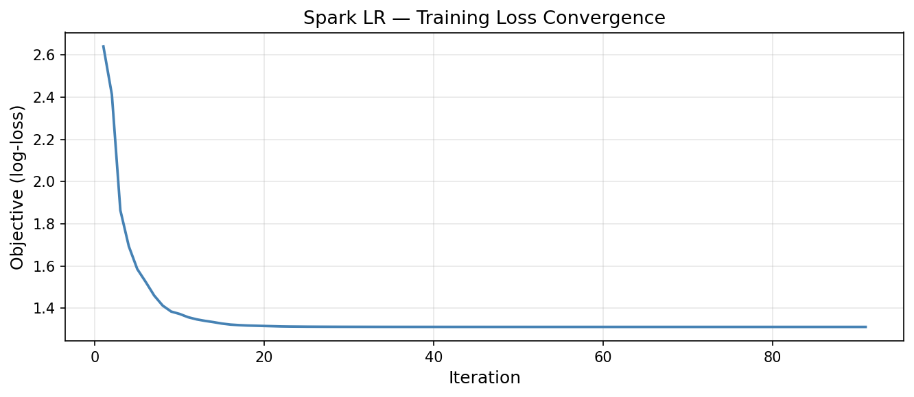
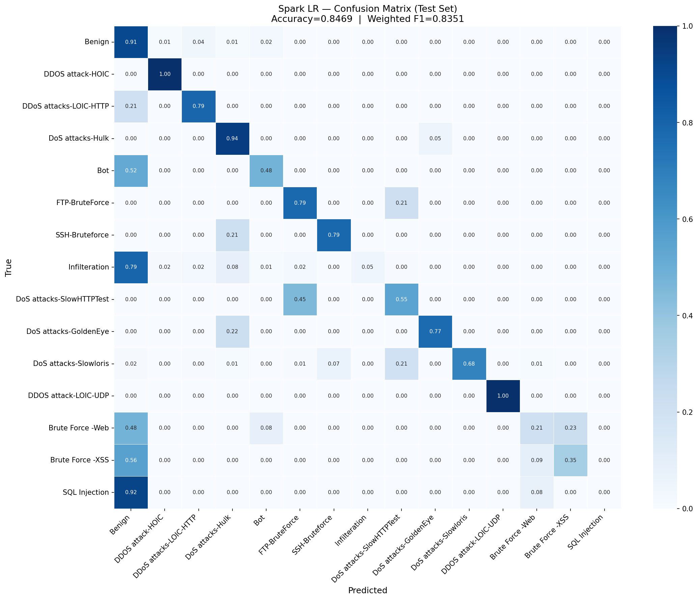
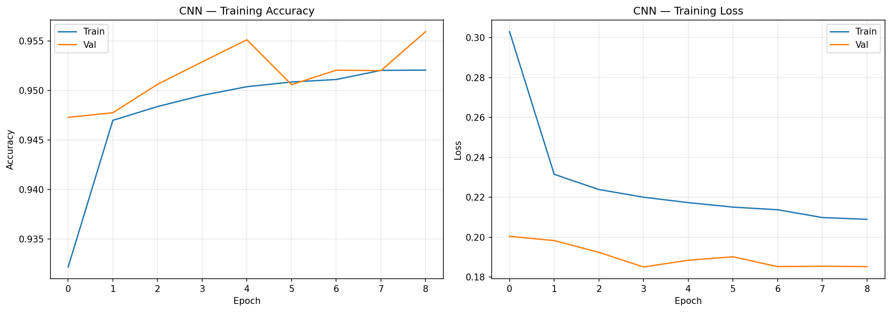
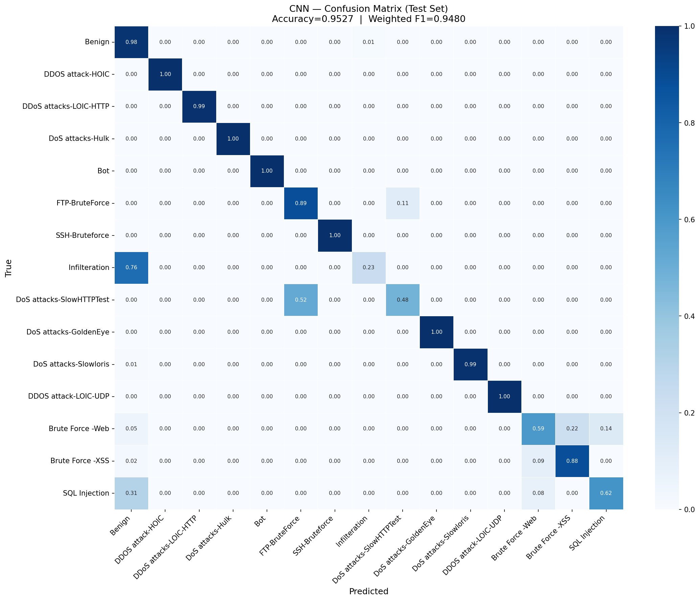
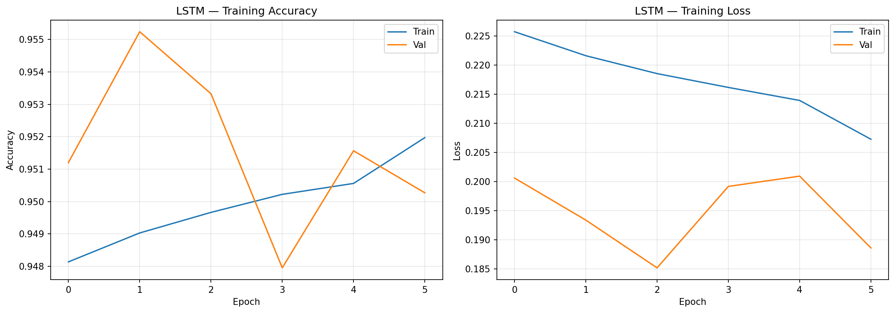
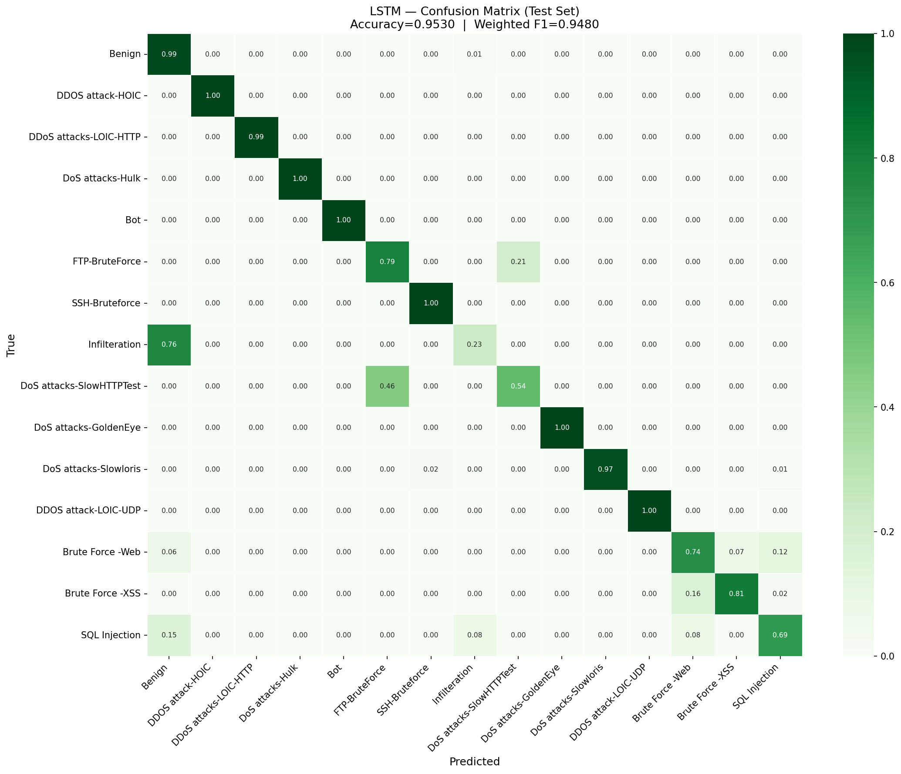

# Realtime Network Intrusion Detection System

A real-time network intrusion detection system built on a distributed big data stack. The system ingests network traffic via Apache Kafka, classifies flows using machine learning models trained on the CIC-IDS-2018 dataset, and persists alerts to MongoDB. Three models are implemented and compared: Logistic Regression (Spark MLlib), CNN, and LSTM (Keras/TensorFlow).

---

## Table of Contents

- [Architecture](#architecture)
- [Dataset](#dataset)
- [Project Structure](#project-structure)
- [Pipeline Overview](#pipeline-overview)
- [Models](#models)
- [Results](#results)
- [Streaming Pipeline](#streaming-pipeline)
- [Setup and Usage](#setup-and-usage)
- [Technologies](#technologies)
- [Reference](#reference)

---

## Architecture

```
Raw CSVs (CIC-IDS-2018)
        │
        ▼
┌─────────────────────┐
│  Spark Preprocessing │  batch_preprocessing.ipynb
│  - Clean & clip      │  - Drop nulls, clip outliers
│  - Encode labels     │  - StringIndexer → label_idx
│  - Feature selection │  - Random Forest importance
│  - Stratified split  │  - Train / Val / Test (70/15/15)
└────────┬────────────┘
         │ HDFS (parquet)
         ▼
┌─────────────────────┐     ┌──────────────────────┐
│   Spark MLlib LR    │     │  Keras CNN / LSTM     │
│   SparkLR.ipynb     │     │  CNN_IDS.ipynb        │
│   84.69% accuracy   │     │  LSTM_IDS.ipynb       │
└────────┬────────────┘     │  ~95.3% accuracy      │
         │ PipelineModel    └──────────────────────┘
         │ (HDFS)
         ▼
┌─────────────────────────────────────────────────────┐
│              Real-Time Streaming Pipeline            │
│                                                      │
│  Test Parquet ──► Kafka Producer ──► Kafka Topic     │
│                   (pandas, 155 rec/s)  network-traffic│
│                                           │          │
│                              Spark Structured        │
│                              Streaming Consumer      │
│                              (5s micro-batches)      │
│                                           │          │
│                              LR PipelineModel        │
│                              .transform()            │
│                                           │          │
│                         ┌─────────────────┴───────┐  │
│                         │       MongoDB            │  │
│                         │  ids_results.predictions │  │
│                         │  ids_results.alerts      │  │
│                         └─────────────────────────┘  │
└─────────────────────────────────────────────────────┘
```

---

## Dataset

**CIC-IDS-2018** — Canadian Institute for Cybersecurity Intrusion Detection Dataset 2018

| Property | Value |
|---|---|
| Source | Canadian Institute for Cybersecurity |
| Raw size | ~6.3M flow records |
| Features | 80 network flow features |
| Classes | 15 (1 Benign + 14 attack types) |
| Format | CSV per day of capture |

### Attack Classes

| Label | Attack Type | Category |
|---|---|---|
| 0 | Benign | Normal traffic |
| 1 | DDOS attack-HOIC | DDoS |
| 2 | DDoS attacks-LOIC-HTTP | DDoS |
| 3 | DoS attacks-Hulk | DoS |
| 4 | Bot | Botnet |
| 5 | FTP-BruteForce | Brute Force |
| 6 | SSH-Bruteforce | Brute Force |
| 7 | Infilteration | Infiltration |
| 8 | DoS attacks-SlowHTTPTest | DoS |
| 9 | DoS attacks-GoldenEye | DoS |
| 10 | DoS attacks-Slowloris | DoS |
| 11 | DDOS attack-LOIC-UDP | DDoS |
| 12 | Brute Force -Web | Brute Force |
| 13 | Brute Force -XSS | Web Attack |
| 14 | SQL Injection | Web Attack |

---

## Project Structure

```
Realtime-Network-IDS/
├── workspace/
│   ├── notebooks/
│   │   ├── batch_preprocessing.ipynb      # Spark data pipeline
│   │   ├── SparkLR.ipynb                  # Logistic Regression model
│   │   ├── CNN_IDS.ipynb                  # CNN model (Colab)
│   │   └── LSTM_IDS.ipynb                 # LSTM model (Colab)
│   ├── scripts/
│   │   ├── kafka_producer.py              # Streams test records to Kafka
│   │   └── spark_streaming_consumer.py    # Consumes, classifies, logs to MongoDB
│   ├── output/
│   │   ├── CNN/                           # CNN metrics, plots, confusion matrix
│   │   ├── LSTM/                          # LSTM metrics, plots, confusion matrix
│   │   └── SparkLR/                       # LR metrics, convergence plot
│   └── logs/                              # Producer, consumer, MongoDB session logs
├── docker-compose.yaml                    # Full stack: HDFS, Spark, Kafka, MongoDB
├── Dockerfile.jupyter                     # Jupyter + PySpark environment
└── README.md
```

---

## Pipeline Overview

### 1. Preprocessing (`batch_preprocessing.ipynb`)

- Loads raw CIC-IDS-2018 CSVs into HDFS via Spark
- Drops null rows, clips numerical outliers at 1st/99th percentile
- Encodes string labels to integer indices via `StringIndexer`, saves `label_mapping` CSV
- Trains a Random Forest to rank features by importance; selects **top 30** (excluding `timestamp_unix` to prevent data leakage — 29 final features)
- Applies oversampling: classes with fewer than 5,000 training samples resampled with replacement
- Stratified 70/15/15 train/val/test split saved as parquet to HDFS

### 2. Feature Selection

Top 29 features selected by Random Forest importance (`timestamp_unix` excluded to prevent leakage):

`Init Fwd Win Byts`, `Dst Port`, `Fwd Seg Size Min`, `Fwd Pkt Len Max`, `Fwd Header Len`, `Subflow Fwd Byts`, `TotLen Fwd Pkts`, `Flow Duration`, `Flow IAT Max`, `Fwd IAT Min`, `Flow IAT Min`, `Fwd Pkts/s`, `Fwd Seg Size Avg`, `Flow Pkts/s`, `Flow IAT Mean`, `Fwd IAT Max`, `Fwd Pkt Len Mean`, `Init Bwd Win Byts`, `Fwd IAT Mean`, `Fwd IAT Tot`, `Fwd Pkt Len Std`, `Bwd Pkt Len Mean`, `Pkt Len Std`, `Bwd Pkts/s`, `Bwd Seg Size Avg`, `Bwd Pkt Len Std`, `Tot Fwd Pkts`, `Pkt Size Avg`, `Subflow Fwd Pkts`

### 3. Class Imbalance Handling

Both oversampling and inverse-frequency class weighting are applied across all models:

| Method | Details |
|---|---|
| Oversampling | Minority classes resampled to 5,000 minimum training samples |
| Class weights | Inverse-frequency, capped at 15.0, Benign floor at 0.4 |

---

## Models

### Model 1 — Spark Logistic Regression

Implemented natively in **Spark MLlib** as a full Pipeline (VectorAssembler → StandardScaler → LR), enabling direct use in the streaming consumer via `model.transform()`.

| Hyperparameter | Value |
|---|---|
| Family | Multinomial |
| Max iterations | 150 |
| Reg param | 0.01 (grid search) |
| Elastic net param | 0.5 (grid search) |
| Scaler | StandardScaler (withMean, withStd) |
| Training time | 15.32 min |
| Converged at | 91 iterations |

### Model 2 — CNN (Convolutional Neural Network)

```
Input (29, 1)
    │
Conv1D (64 filters, kernel=3, relu, padding=same)
    │
MaxPooling1D (pool_size=2)
    │
Conv1D (128 filters, kernel=3, relu, padding=same)
    │
MaxPooling1D (pool_size=2)
    │
Flatten → Dense (200, relu) → Dropout (0.5)
    │
Dense (15, softmax)
```

| Hyperparameter | Value |
|---|---|
| Optimizer | Adam (lr=0.0001) |
| Loss | Categorical crossentropy |
| Batch size | 256 |
| Epochs trained | 9 / 50 (early stopping) |
| Training time | 20.22 min (T4 GPU) |

### Model 3 — LSTM (Long Short-Term Memory)

```
Input (29, 1)
    │
LSTM (200 units, return_sequences=True) → Dropout (0.5)
    │
LSTM (200 units) → Dropout (0.5)
    │
Dense (15, softmax)
```

| Hyperparameter | Value |
|---|---|
| Optimizer | Adam (lr=0.0001) |
| Loss | Categorical crossentropy |
| Batch size | 256 |
| Epochs trained | 9 / 50 (early stopping) |
| Training time | ~81 min (T4 GPU) |

> CNN and LSTM treat the 29 features as a 1D sequence (29 timesteps × 1 channel).

---

## Results

### Overall Accuracy

| Model | Test Accuracy | Weighted F1 | Macro F1 | Training Time |
|---|---|---|---|---|
| Spark LR | 84.69% | 0.8351 | 0.5781 | 15.32 min |
| CNN | 95.27% | 0.9480 | 0.7253 | 20.22 min |
| LSTM | 95.30% | ~0.9480 | ~0.7260 | ~81 min |

CNN and LSTM achieve similar accuracy (~95.3%) but CNN trains ~4× faster. LR trades accuracy for distributed scalability — it is a native Spark PipelineModel and powers the real-time streaming pipeline.

### Per-Class F1 Comparison

| Attack | LR F1 | CNN F1 | LSTM F1 |
|---|---|---|---|
| Benign | 0.8907 | 0.9715 | 0.9735 |
| DDOS attack-HOIC | 0.9749 | 0.9999 | 0.9999 |
| DDoS attacks-LOIC-HTTP | 0.7855 | 0.9957 | 0.9960 |
| DoS attacks-Hulk | 0.8843 | 0.9996 | 0.9994 |
| Bot | 0.5625 | 0.9973 | 0.9985 |
| FTP-BruteForce | 0.7312 | 0.7835 | 0.7471 |
| SSH-Bruteforce | 0.8768 | 0.9990 | 0.9986 |
| Infilteration | 0.0856 | 0.3340 | 0.3368 |
| DoS attacks-SlowHTTPTest | 0.5857 | 0.5853 | 0.5918 |
| DoS attacks-GoldenEye | 0.6465 | 0.9977 | 0.9959 |
| DoS attacks-Slowloris | 0.7949 | 0.9733 | 0.9628 |
| DDOS attack-LOIC-UDP | 0.4890 | 0.8134 | 0.8108 |
| Brute Force -Web | 0.0437 | 0.3363 | 0.3213 |
| Brute Force -XSS | 0.0215 | 0.0844 | 0.0857 |
| SQL Injection | 0.0000 | 0.0082 | 0.0251 |

> Infilteration, Brute Force -XSS, and SQL Injection remain challenging across all models due to extreme class imbalance (86–192 test samples vs 900K+ Benign) and feature overlap with majority classes.

### LR Training Convergence



### LR Confusion Matrix



### CNN Training Curves



### CNN Confusion Matrix



### LSTM Training Curves



### LSTM Confusion Matrix



---

## Streaming Pipeline

The real-time pipeline uses the Spark LR model because it is a native Spark PipelineModel — classification requires only `model.transform(df)` with no additional preprocessing or reshaping. CNN/LSTM operate outside Spark and are not suitable for direct integration into Spark Structured Streaming without significant added complexity.

### Flow

```
test_split/ (parquet)
    │
    ▼  kafka_producer.py (pandas, no Spark — avoids competing for worker cores)
Kafka topic: network-traffic (3 partitions, KRaft mode)
    │
    ▼  spark_streaming_consumer.py
Spark Structured Streaming (5s micro-batches, maxOffsetsPerTrigger=10,000)
    │
    ▼
LR PipelineModel.transform()
    │
    ├──► MongoDB ids_results.predictions  (all records)
    └──► MongoDB ids_results.alerts       (attacks only)
```

### Streaming Results (708,779 records)

| Metric | Value |
|---|---|
| Total predictions | 708,779 |
| Correct predictions | 590,700 |
| Streaming accuracy | 83.34% |
| Batch test accuracy | 84.69% |
| Accuracy gap | 1.35% |
| Total alerts generated | 380,839 |
| Producer throughput | ~155 rec/s |
| Consumer trigger interval | 5 seconds |

Streaming accuracy (83.34%) is within 1.5% of batch test accuracy (84.69%), validating pipeline consistency. The small gap is attributable to the sequential parquet file ordering — test split partitions are not shuffled across batches, causing per-batch class distributions to differ from the overall test distribution.

### MongoDB Schema

**`ids_results.predictions`** — all classified records:
```json
{
  "batch_id": 42,
  "detection_time": "2026-02-22 10:30:15",
  "predicted_label": "DDoS attacks-LOIC-HTTP",
  "prediction": 2,
  "true_label": "DDoS attacks-LOIC-HTTP",
  "label_idx": 2,
  "correct": true,
  "is_attack": true,
  "is_high_priority": true
}
```

**`ids_results.alerts`** — attacks only (subset of predictions where `is_attack = true`).

---

## Setup and Usage

### Prerequisites

- Docker Desktop (8GB RAM allocated minimum)
- Python 3.10+

### Start the Stack

```bash
docker-compose up -d
```

Services: `namenode`, `datanode`, `spark-master`, `spark-worker`, `spark-jupyter`, `kafka`, `mongodb`

### Access Points

| Service | URL |
|---|---|
| Jupyter (Spark) | http://localhost:9000 |
| HDFS Namenode UI | http://localhost:9870 |
| Spark Master UI | http://localhost:8080 |
| MongoDB | mongodb://localhost:27017 |

### 1. Run Preprocessing

Open `workspace/notebooks/batch_preprocessing.ipynb` in Jupyter and run all cells. Outputs written to HDFS at `/user/spark/ids/processed/`.

### 2. Train Logistic Regression

Open `workspace/notebooks/SparkLR.ipynb` and run all cells. Model saved to HDFS at `/user/spark/ids/models/spark_lr`.

### 3. Train CNN / LSTM (Google Colab)

Copy data from HDFS:
```bash
docker exec -it namenode bash -c "hdfs dfs -get /user/spark/ids/processed/splits_stratified /tmp/splits"
docker cp namenode:/tmp/splits ./workspace/dataset/splits_stratified

docker exec -it namenode bash -c "hdfs dfs -get /user/spark/ids/processed/label_mapping /tmp/lm"
docker cp namenode:/tmp/lm ./workspace/dataset/label_mapping

docker exec -it namenode bash -c "hdfs dfs -get /user/spark/ids/processed/rf_feature_importance /tmp/rf"
docker cp namenode:/tmp/rf ./workspace/dataset/rf_feature_importance
```

Upload `workspace/dataset/` to Google Drive under `ids-project/`, open `CNN_IDS.ipynb` or `LSTM_IDS.ipynb` in Colab, set Runtime → T4 GPU, update `DRIVE_BASE`, run all cells.

### 4. Run the Streaming Pipeline

Install dependencies:
```bash
docker exec -it spark-jupyter pip install kafka-python pymongo --break-system-packages
```

Create Kafka topic:
```bash
docker exec -it kafka bash -c "kafka-topics --bootstrap-server kafka:9092 \
  --create --topic network-traffic --partitions 3 --replication-factor 1"
```

Copy test split locally:
```bash
docker exec -it namenode bash -c \
  "hdfs dfs -get /user/spark/ids/processed/splits_stratified/test /tmp/test_split"
docker cp namenode:/tmp/test_split ./workspace/dataset/test_split
```

Terminal 1 — Start consumer:
```bash
docker exec -it spark-jupyter python3 /opt/work/scripts/spark_streaming_consumer.py
```

Terminal 2 — Start producer:
```bash
docker exec -it spark-jupyter python3 /opt/work/scripts/kafka_producer.py --delay 0.005
```

### 5. Verify MongoDB Results

```bash
docker exec -it mongodb mongosh ids_results
```
```js
db.predictions.countDocuments()
db.alerts.countDocuments()
db.alerts.aggregate([
  {$group: {_id: "$predicted_label", count: {$sum: 1}}},
  {$sort: {count: -1}}
]).toArray()
// Accuracy check
var total = db.predictions.countDocuments()
var correct = db.predictions.countDocuments({correct: true})
print("Streaming accuracy:", (correct/total*100).toFixed(2) + "%")
```

---

## Technologies

| Component | Technology | Version |
|---|---|---|
| Distributed storage | Apache HDFS | 3.3.x |
| Distributed compute | Apache Spark | 3.5.1 |
| ML — Logistic Regression | Spark MLlib | 3.5.1 |
| ML — CNN / LSTM | TensorFlow / Keras | 2.x |
| Message broker | Apache Kafka | KRaft mode |
| Database | MongoDB | 6.0 |
| Notebook environment | JupyterLab + PySpark | — |
| Containerisation | Docker Compose | — |
| Language | Python | 3.11 / 3.12 |

---

## Reference

This project is partly based on the methodology described in:

> Hagar, A. A., & Gawali, B. W. (2022). *Apache Spark and deep learning models for high-performance network intrusion detection using CSE-CIC-IDS2018.* Computational Intelligence and Neuroscience, 2022, Article 3131153. [https://doi.org/10.1155/2022/3131153](https://doi.org/10.1155/2022/3131153)

The paper implements LR, CNN, and LSTM on the CIC-IDS-2018 dataset and reports 98–100% per-class accuracy for deep learning models. This project replicates the core methodology within a distributed big data pipeline, extending it with real-time Kafka streaming and MongoDB persistence.
